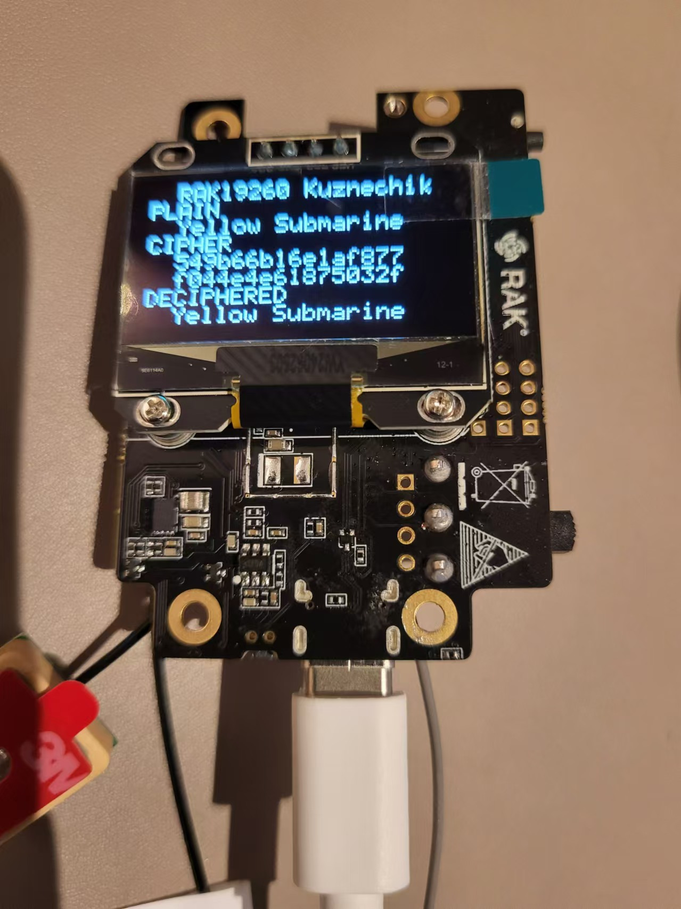

# Arduino

```
PLAIN
Yellow Submarine
CIPHER
   +------------------------------------------------+ +----------------+
   |.0 .1 .2 .3 .4 .5 .6 .7 .8 .9 .a .b .c .d .e .f | |      ASCII     |
   +------------------------------------------------+ +----------------+
 0.|54 9b 66 b1 6e 1a f8 77 f0 44 e4 e6 18 75 03 2f | |T.f.n..w.D...u./|
   +------------------------------------------------+ +----------------+
DECIPHERED
Yellow Submarine
```

