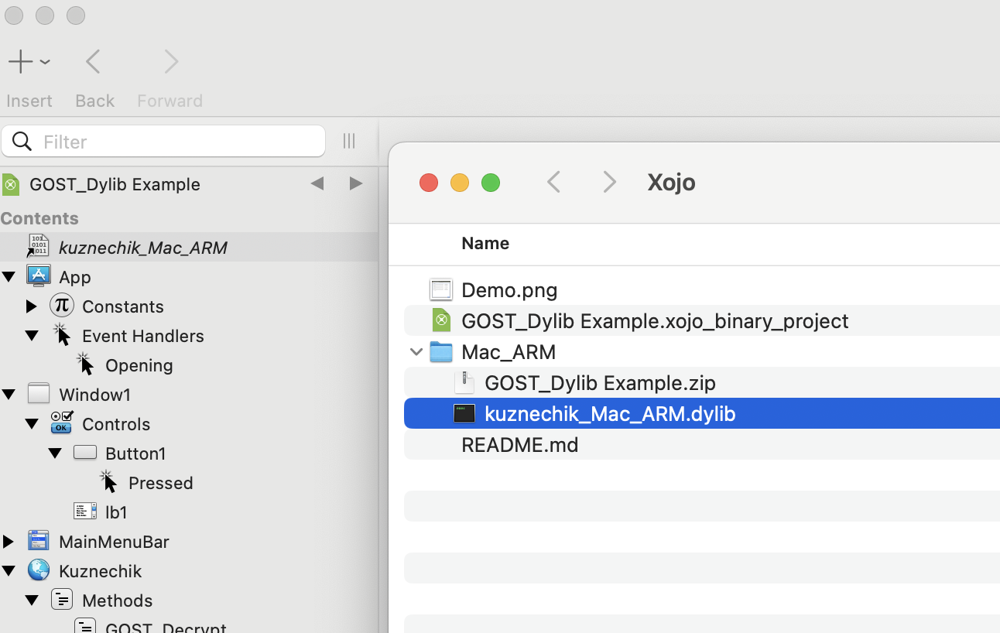
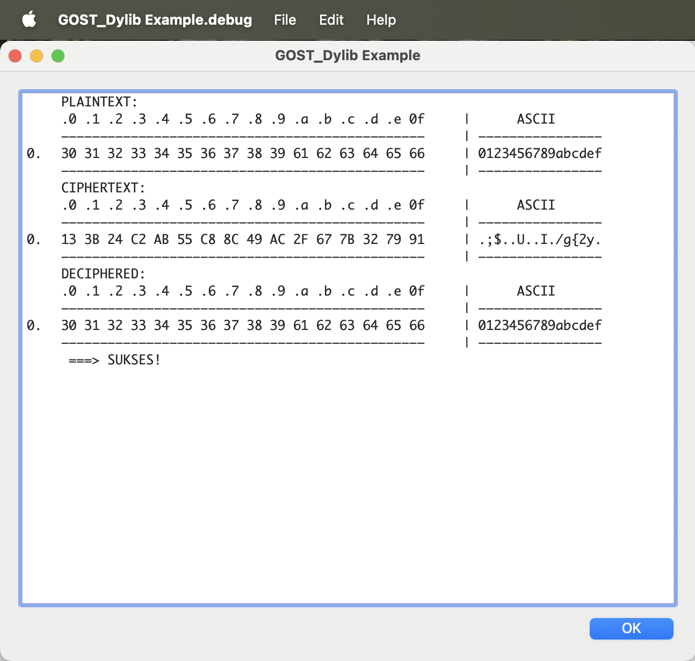

# INSTRUCTIONS

After compiling the dylib, name it (or a copy) kuznechik_Mac_ARM.dylib for Mac ARM (or other platform), and drop it into the Xojo. A Mac/ARM version is provided.

Run/Compile. Here's the result:

